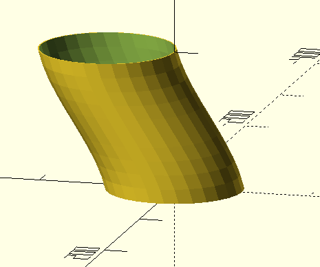

# OpenScad Library to generate fan-ducts
## Parallel Tube
Generate tubes, follwing splines, and connecting circular openings in parallel planes.
The library builds a union out of stacked and sheared cylinders.

